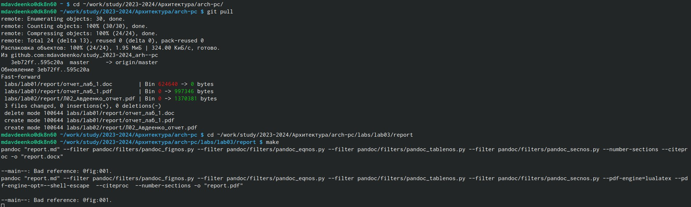
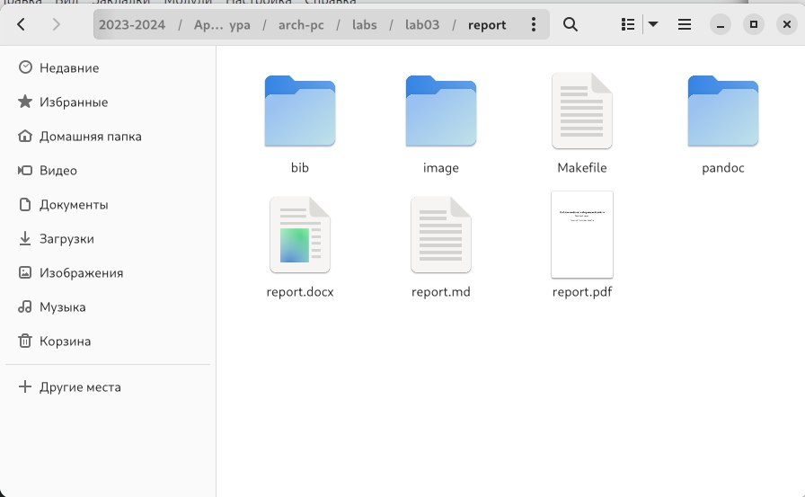
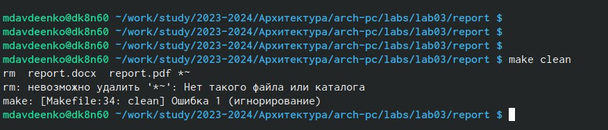
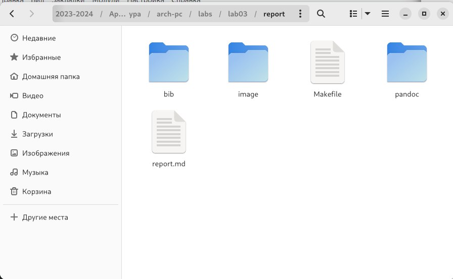
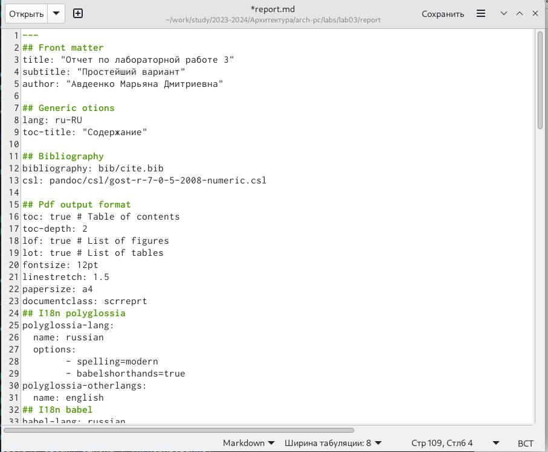

---
## Front matter
title: "Отчет по лабораторной работе 3"
subtitle: ""
author: "Авдеенко Марьяна Дмитриевна"

## Generic otions
lang: ru-RU
toc-title: "Содержание"

## Bibliography
bibliography: bib/cite.bib
csl: pandoc/csl/gost-r-7-0-5-2008-numeric.csl

## Pdf output format
toc: true # Table of contents
toc-depth: 2
lof: true # List of figures
lot: true # List of tables
fontsize: 12pt
linestretch: 1.5
papersize: a4
documentclass: scrreprt
## I18n polyglossia
polyglossia-lang:
  name: russian
  options:
	- spelling=modern
	- babelshorthands=true
polyglossia-otherlangs:
  name: english
## I18n babel
babel-lang: russian
babel-otherlangs: english
## Fonts
mainfont: PT Serif
romanfont: PT Serif
sansfont: PT Sans
monofont: PT Mono
mainfontoptions: Ligatures=TeX
romanfontoptions: Ligatures=TeX
sansfontoptions: Ligatures=TeX,Scale=MatchLowercase
monofontoptions: Scale=MatchLowercase,Scale=0.9
## Biblatex
biblatex: true
biblio-style: "gost-numeric"
biblatexoptions:
  - parentracker=true
  - backend=biber
  - hyperref=auto
  - language=auto
  - autolang=other*
  - citestyle=gost-numeric
## Pandoc-crossref LaTeX customization
figureTitle: "Рис."
tableTitle: "Таблица"
listingTitle: "Листинг"
lofTitle: "Список иллюстраций"
lotTitle: "Список таблиц"
lolTitle: "Листинги"
## Misc options
indent: true
header-includes:
  - \usepackage{indentfirst}
  - \usepackage{float} # keep figures where there are in the text
  - \floatplacement{figure}{H} # keep figures where there are in the text
---

# Цель работы

Освоить навыки оформления отчётов с помощью языка разметки Markdown.

# Задание

Здесь приводится описание задания в соответствии с рекомендациями
методического пособия и выданным вариантом.

# Теоретическое введение

Здесь описываются теоретические аспекты, связанные с выполнением работы.

Например, в табл. @tbl:std-dir приведено краткое описание стандартного синтаксиса Markdown.

: Описание некоторых символов языка разметки Markdown  {#tbl:std-dir}

| Символ | Описание опции символа                                                                                                         |
|--------------|----------------------------------------------------------------------------------------------------------------------------|
|  #         | Символ создающий заголовок файловую                                                                               |
| **bold**     | Символы для того, чтобы задать тексту полужирное начертание (заключите текст в двойные звездочки)     |
| *italic*       | Символы для того, чтобы задать тексту курсивное начертание (заключите текст в двойные звездочки)                                            |
| ***bold and italic***      | Символы для того, чтобы задать тексту полужирное и курсивное начертание (заключите текст в двойные звездочки) |
| >     | Символдля создания блоков цитирования                                                                                   |
| 1, 2, 3...     | Символ для форматирования списка (создается с помощью соответствующих цифр)                                                                                    |
| *       | Символ для создания неупорядоченного (маркированного) списка                                                                                                   |

# Выполнение лабораторной работы

1) Открыла терминал.
2) Открыла каталог созданный в ходе 2-ой лабораторной работы (cd ~/work/study/2023-2024/Архитектура/arch-pc/), затем обновила локальный репозиторий (команда git pull) (рис. @fig:001).

{#fig:001 width=70%}

3) Перешла в каталог с шаблоном отчета по 3-ей лабораторной работе.
4) Провела компиляцию шаблона с использованием Makefile (команда make), после чего проверила корректность полученных файлов (рис. @fig:002).

{#fig:002 width=70%}

5) Удалила полученный файл с использованием Makefile (команда make clean) (рис. @fig:003).

{#fig:003 width=70%}

6) Проверила наличие файлов report.pdf и report.docx, их не оказалось (рис. @fig:004).

{#fig:004 width=70%}

7) Открыла файл report.md c помощью текстового редактора, использовала gedit (команда gedit report.md) (рис. @fig:005).

{#fig:005 width=70%}

8) Заполнила отчёт.

# Выводы

В ходе данной лабораторной работы были освоены навыки оформления отчётов с помощью языка разметки Markdown.

# Список литературы{.unnumbered}

::: {#refs}
:::
