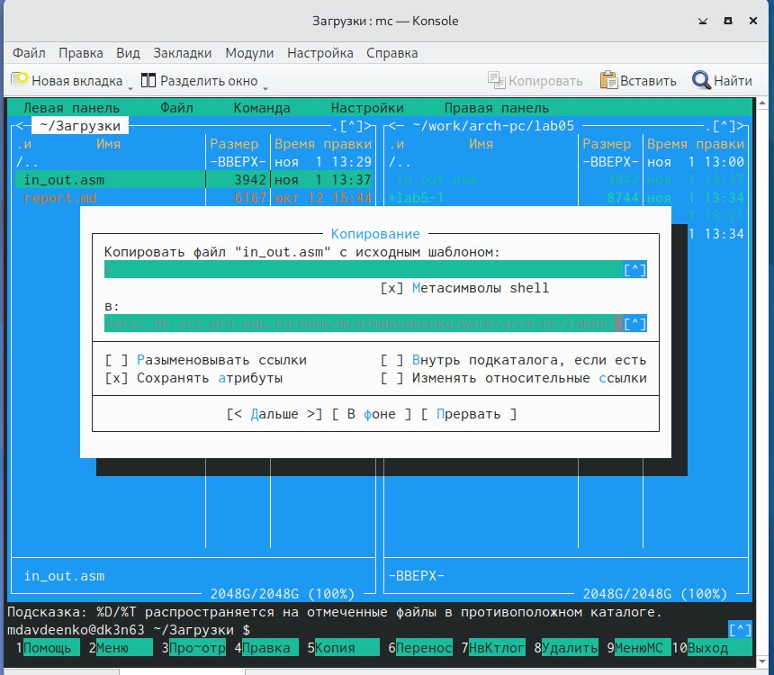

---
## Front matter
title: "Отчет по лабораторной работе №5"
subtitle: "Дисциплина: Архитектура компьютера"
author: "Авдеенко Марьяна Дмитриевна"

## Generic otions
lang: ru-RU
toc-title: "Содержание"

## Bibliography
bibliography: bib/cite.bib
csl: pandoc/csl/gost-r-7-0-5-2008-numeric.csl

## Pdf output format
toc: true # Table of contents
toc-depth: 2
lof: true # List of figures
lot: true # List of tables
fontsize: 12pt
linestretch: 1.5
papersize: a4
documentclass: scrreprt
## I18n polyglossia
polyglossia-lang:
  name: russian
  options:
	- spelling=modern
	- babelshorthands=true
polyglossia-otherlangs:
  name: english
## I18n babel
babel-lang: russian
babel-otherlangs: english
## Fonts
mainfont: PT Serif
romanfont: PT Serif
sansfont: PT Sans
monofont: PT Mono
mainfontoptions: Ligatures=TeX
romanfontoptions: Ligatures=TeX
sansfontoptions: Ligatures=TeX,Scale=MatchLowercase
monofontoptions: Scale=MatchLowercase,Scale=0.9
## Biblatex
biblatex: true
biblio-style: "gost-numeric"
biblatexoptions:
  - parentracker=true
  - backend=biber
  - hyperref=auto
  - language=auto
  - autolang=other*
  - citestyle=gost-numeric
## Pandoc-crossref LaTeX customization
figureTitle: "Рис."
tableTitle: "Таблица"
listingTitle: "Листинг"
lofTitle: "Список иллюстраций"
lotTitle: "Список таблиц"
lolTitle: "Листинги"
## Misc options
indent: true
header-includes:
  - \usepackage{indentfirst}
  - \usepackage{float} # keep figures where there are in the text
  - \floatplacement{figure}{H} # keep figures where there are in the text
---

# Цель работы

Приобрести практические навыки работы в Midnight Commander.

# Задание

Здесь приводится описание задания в соответствии с рекомендациями
методического пособия и выданным вариантом.

# Теоретическое введение

Midnight Commander (или просто mc) — это программа, которая позволяет просматривать структуру каталогов и выполнять основные операции по управлению файловой системой, т.е. mc является файловым менеджером. Midnight Commander позволяет сделать работу с файлами более удобной и наглядной. Для активации оболочки Midnight Commander достаточно ввести в командной строке mc и нажать клавишу Enter. В Midnight Commander используются функциональные клавиши F1 — F10 , к которым привязаны часто выполняемые операции.

Следующие комбинации клавиш облегчают работу с Midnight Commander:
* Tab используется для переключениями между панелями;
* клавиши "вверх" и "вниз" используется для навигации, Enter для входа в каталог или открытия файла
(если в файле расширений mc.ext заданы правила связи определённых расширений
файлов с инструментами их запуска или обработки);
* Ctrl + u (или через меню Команда > Переставить панели ) меняет местами содержимое
правой и левой панелей;
* Ctrl + o (или через меню Команда > Отключить панели ) скрывает или возвращает панели
Midnight Commander, за которыми доступен для работы командный интерпретатор
оболочки и выводимая туда информация.
* Ctrl + x + d (или через меню Команда > Сравнить каталоги ) позволяет сравнить содер-
жимое каталогов, отображаемых на левой и правой панелях.
Дополнительную информацию о Midnight Commander можно получить по команде man
mc и на странице проекта.

# Выполнение лабораторной работы

1) Открыла *Midnight Commander*.

2) Пользуясь клавишами "вверх" , "вниз" и Enter перешла в каталог ~/work/arch-pc, созданный
при выполнении лабораторной работы №4 (рис. @fig:001, @fig:002).

{#fig:001 width=70%}

{#fig:002 width=70%}

3) С помощью функциональной клавиши F7 создала папку lab05 (рис. @fig:003) и перешла
в созданный каталог (рис. @fig:004).

{#fig:003 width=70%}

{#fig:004 width=70%}

4) Пользуясь строкой ввода и командой touch создала файл lab5-1.asm (рис. @fig:005).

{#fig:005 width=70%}

5) С помощью функциональной клавиши F4 открыла файл lab5-1.asm для редактирова-
ния во встроенном редакторе (рис. @fig:006). 

{#fig:006 width=70%}

6) Ввела текст программы из листинга 5.1, сохранила изме-
нения и закрыла файл. 

7) С помощью функциональной клавиши F3 открыла файл lab5-1.asm для просмотра.
Убедилась, что файл содержит текст программы. (рис. @fig:007).

{#fig:007 width=70%}

8) Оттранслировала текст программы lab5-1.asm в объектный файл. Выполнила компо-
новку объектного файла и запуститла получившийся исполняемый файл. Программа
вывела строку 'Введите строку:', где ввела свои ФИО (рис. @fig:008).

{#fig:008 width=70%}

9) Скачала файл in_out.asm со страницы курса в ТУИС (рис. @fig:009).

{#fig:009 width=70%}

10) Подключаемый файл in_out.asm должен лежать в том же каталоге, что и файл с про-
граммой, в которой он используется, поэтому файл in_out.asm переложила в папку work/arch-pc/lab05 (рис. @fig:010).

{#fig:010 width=70%}

11) С помощью функциональной клавиши F6 создала копию файла lab5-1.asm с именем
lab5-2.asm. Выделила файл lab5-1.asm, нажала клавишу F6, ввела имя файла
lab5-2.asm и нажала клавишу Enter (рис. @fig:011).

{#fig:011 width=70%}

12) Исправила текст программы в файле lab5-2.asm с использование подпрограмм из
внешнего файла in_out.asm в соответствии с листингом 5.2 (рис. @fig:012). Создала исполняемый файл и проверила его работу.

{#fig:012 width=70%}

13) В файле lab5-2.asm заменила подпрограмму sprintLF на sprint (рис. @fig:013). Создала исполняемый файл и проверьте его работу (рис. @fig:014).

{#fig:013 width=70%}

{#fig:014 width=70%}

# Задания самостоятельной работы

1) Создала копию файла lab5-1.asm. Внесла изменения в программу (без использова-
ния внешнего файла in_out.asm), так чтобы она работала по следующему алгоритму:
* вывести приглашение типа “Введите строку:”;
* ввести строку с клавиатуры (рис. @fig:015).

{#fig:015 width=70%}

2) Получила исполняемый файл и проверила его работу. На приглашение ввести строку
ввела свою *фамилию* (рис. @fig:016).

{#fig:016 width=70%}

3) Создайте копию файла lab5-2.asm. Исправьте текст программы с использование под-
программ из внешнего файла in_out.asm, так чтобы она работала по следующему
алгоритму:
* вывести приглашение типа “Введите строку:”;
* ввести строку с клавиатуры (рис. @fig:017).

{#fig:017 width=70%}

4) Получите исполняемый файл и проверьте его работу. На приглашение ввести строку
введите номер своей группы (рис. @fig:018).

{#fig:018 width=70%}

# Выводы

В ходе данной лабораторной работы были приобретены практические навыки работы в Midnight Commander.

# Список литературы{.unnumbered}

::: {#refs}
:::
