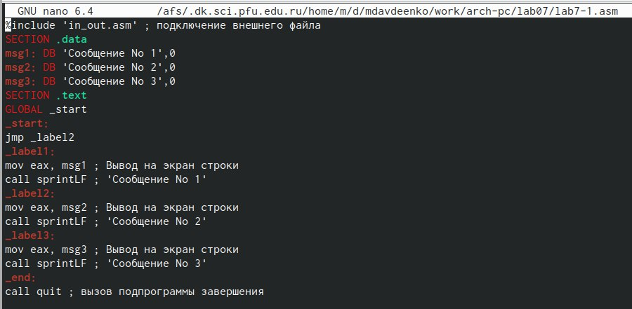
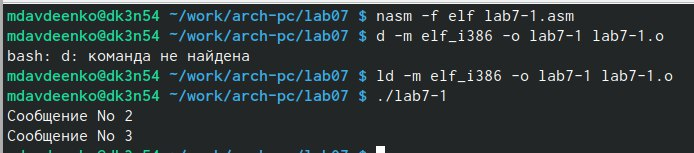
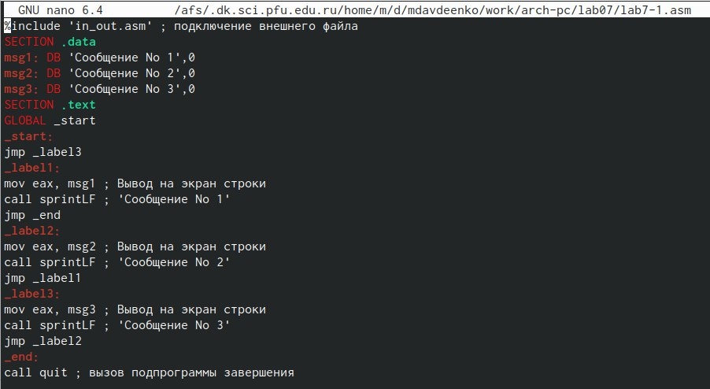
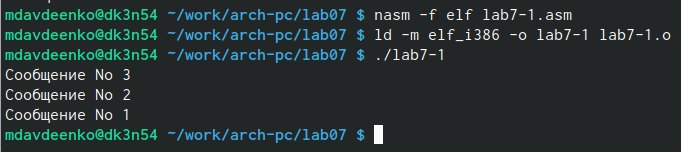
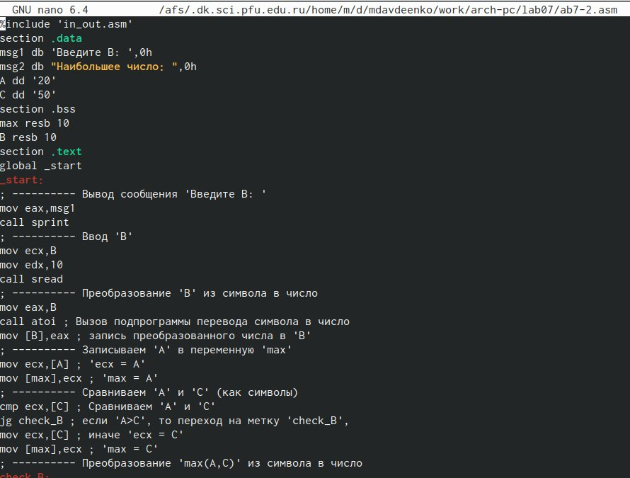
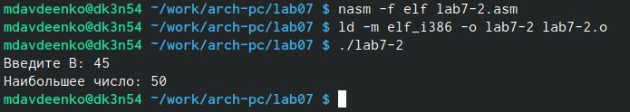
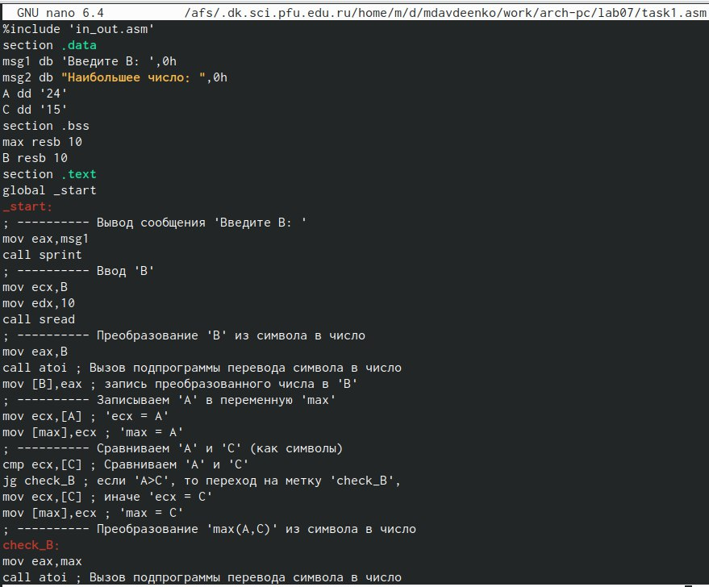
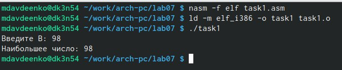

---
## Front matter
title: "Отчет по лабораторной работе №7"
subtitle: "Дисциплина: архитектура компьютера"
author: "Авдеенко Марьяна Дмитриевна"

## Generic otions
lang: ru-RU
toc-title: "Содержание"

## Bibliography
bibliography: bib/cite.bib
csl: pandoc/csl/gost-r-7-0-5-2008-numeric.csl

## Pdf output format
toc: true # Table of contents
toc-depth: 2
lof: true # List of figures
lot: true # List of tables
fontsize: 12pt
linestretch: 1.5
papersize: a4
documentclass: scrreprt
## I18n polyglossia
polyglossia-lang:
  name: russian
  options:
	- spelling=modern
	- babelshorthands=true
polyglossia-otherlangs:
  name: english
## I18n babel
babel-lang: russian
babel-otherlangs: english
## Fonts
mainfont: PT Serif
romanfont: PT Serif
sansfont: PT Sans
monofont: PT Mono
mainfontoptions: Ligatures=TeX
romanfontoptions: Ligatures=TeX
sansfontoptions: Ligatures=TeX,Scale=MatchLowercase
monofontoptions: Scale=MatchLowercase,Scale=0.9
## Biblatex
biblatex: true
biblio-style: "gost-numeric"
biblatexoptions:
  - parentracker=true
  - backend=biber
  - hyperref=auto
  - language=auto
  - autolang=other*
  - citestyle=gost-numeric
## Pandoc-crossref LaTeX customization
figureTitle: "Рис."
tableTitle: "Таблица"
listingTitle: "Листинг"
lofTitle: "Список иллюстраций"
lotTitle: "Список таблиц"
lolTitle: "Листинги"
## Misc options
indent: true
header-includes:
  - \usepackage{indentfirst}
  - \usepackage{float} # keep figures where there are in the text
  - \floatplacement{figure}{H} # keep figures where there are in the text
---

# Цель работы

Изучение команд условного и безусловного переходов. Приобретение навыков написания
программ с использованием переходов. Знакомство с назначением и структурой файла
листинга.

# Задание

Здесь приводится описание задания в соответствии с рекомендациями
методического пособия и выданным вариантом.

# Теоретическое введение

Для реализации ветвлений в ассемблере используются так называемые команды передачи управления или команды перехода. Можно выделить 2 типа переходов:
* условный переход – выполнение или не выполнение перехода в определенную точку программы в зависимости от проверки условия 
* безусловный переход – выполнение передачи управления в определенную точку программы без каких-либо условий.

# Выполнение лабораторной работы

1) Открыла терминал.

2) Перешла в каталог, созданный для лабораторной работы №7 и создала lab7-1.asm.

3) Ввела в файл lab7-1.asm текст программы из листинга 7.1 (рис. @fig:001).

{#fig:001 width=70%}

4) Создала исполняемый файл и запустила его (рис. @fig:002).

{#fig:002 width=70%}

5) Изменила программу таким образом, чтобы она выводила сначала ‘Сообщение No 2’, потом ‘Сообщение No 1’ и завершала работу. Изменила текст программы в соответствии с листингом 7.2 (рис. @fig:003).

{#fig:003 width=70%}

6) Создала исполняемый файл и запустила его (рис. @fig:004).

{#fig:004 width=70%}

7) Создала файл lab7-2.asm в каталоге ~/work/arch-pc/lab07. Внимательно изучила текст
программы из листинга 7.3 и ввела в lab7-2.asm. (рис. @fig:005).

{#fig:005 width=70%}

8) Создайте исполняемый файл и проверьте его работу для разных значений B (рис. @fig:006).

{#fig:006 width=70%}

# Задания самостоятельной рвботы

9) Напишите программу нахождения наименьшей из 3 целочисленных переменных a, b c. Значения переменных выбрать из табл. 7.5 в соответствии с вариантом, полученным при выполнении лабораторной работы №6 (рис. @fig:007).

{#fig:007 width=70%}

10)Создала исполняемый файл и проверила его работу (рис. @fig:008).

{#fig:008 width=70%}

# Выводы

В ходе данной лабораторной работы были освоены команды условного и безусловного переходов, приобретены навыки написания программ с использованием переходов.

# Список литературы{.unnumbered}

::: {#refs}
:::
